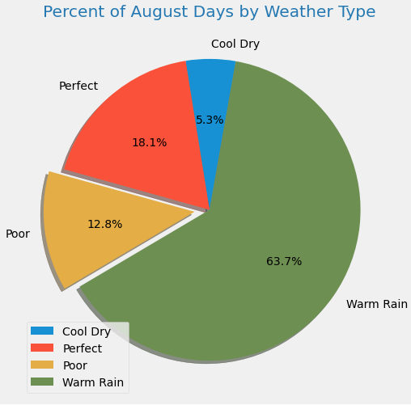

# Surf n' Shake Shop: Investor Analysis

## Overview
Wanting to fulfill my dream of living...*and making a living*... in Hawaii, I have reached out to investor, W. Avy, to help finance the launch of my business, the **Surf n' Shake** shop, a place you can get all your surfing and ice cream needs met on the island of Ohau!

While W. Avy loved the idea (being a surfer himself) and the proposal, he did have concerns about the weather. To address his concerns, we initially analyzed the previous year's precipitation; now, he would like to go further and include information about temperature trends before deciding on if (and when) to open the surf shop. 

### Objective
Specifically, W. Avy would like to see statistical temperature data for **June** and **December** from the **weather dataset he has provided** to determine if the surf and ice cream shop business can be sustained throughout the year.

However, that's not all the information W. Avy will be getting from me; making the right decision on if, and when, to open for business is too important!

## Analysis

### Resources  
The weather dataset W. Avy provided is a **SQLite** database, **hawaii.sqlite**, and is located in this repository.  

The data consists of daily precipitation and daily temperatures for the years 2010 - 2016 from weather stations.  Not all weather stations report every day, but it appears that weather station **#USC00519281** has the most consistent and possibly accurate data.  

The data is accessed and analyzed using Python code written in a Jupyter Notebook and accessing several modules and imports, including:  

* numpy
* pandas
* sqlalchemy
	* from sqlalchemy.ext.automap import ```automap_base```
	* from sqlalchemy.orm import Session
	* from sqlalchemy import ```create_engine```, func

### Method
After using the ```create_engine``` function to establish a link and create a session to connect to the SQLite database, reflecting the existing database into a new model, reflecting the tables, and saving the references to each table, the queries are relatively simple to execute for June and December:
```results_jun = session.query(Measurement.date, Measurement.tobs).filter(extract('month', Measurement.date) == '06').all()```
```results_dec = session.query(Measurement.date, Measurement.tobs).filter(extract('month', Measurement.date) == '12').all()```

Getting the summary statistics using ``.describe()`` is also relatively simple once the list of temperatures is converted from a list to a dataframe.

## Results
The temperature data provided in **hawaii.sqlite** details daily information for June vs December Temperatures


Items to note from these results:

1.  The **difference in minimum temperature** between June (summer equinox) and December (winter equinox) is only **8 degrees**.
2.  The **difference in maximum temperature** is even less, only **2 degrees**.
3.  Not surprisingly, the **average temperature differs by only 3.8 degrees**.  
4. However, looking at the distribution of the temperatures, it appears that December has well over 50% of its daily temperatures 73 degrees and below, while June has only 25%. 


Let's dig a little deeper into the number of warm, surfable days in June and December...and how about the precipitation in these months?  Chilly and rainy is not a good combination for business!

## Next Steps
By merging the percipitation data with the daily temperature, we can get an idea of how many days are raining and/or cool (below 73 degrees) that would decrease the demand for ice cream and/or surfing! 

Since we want only one data point per date for both variables, we pick data from station **#USC00519281**, which appears to provide the most complete data set. 

Query:  
```all = session.query(Measurement.date, Measurement.tobs, Measurement.prcp).\```  
```filter(Measurement.station == 'USC00519281').all()```

A defined function, ```weather```, is created that can easily be refactored to include additional - or different - weather conditions scenarios as necessary, or whatever W. Avy considers to be best (and worst) for business. 

For this analysis, the function ```weather``` creates a variable ```weather_type``` that indicates whether the daily weather is

*  "perfect" = temperature at or above 73 degrees (F) and no precipitation
*  "poor" = temperature below 73 degrees (F) and any level of precipitation
*  "cool dry" = temperature below 73 degrees (F) and no precipitation
*  "warm rain" = temperature at or above 73 degrees (F) and any level of precipitation

```
def weather(df):
  if df['temperature'] >= 73.0 and df['precipitation'] <= 0.00:
    return 'perfect'
  elif df['temperature'] >= 73.0 and df['precipitation'] > 0.00:
    return 'warm rain'   
  elif df['temperature'] < 73.0 and df['precipitation'] <= 0.00:
    return 'cool dry'
  else:
    return 'poor'
```

Applying the above conditions, we see that while the variance in average temperatures between December and June is not huge (4 degrees as demonstrated earlier), there is quite a difference in the number (or percentage) of "good" weather days vs "poor" for June and December:


**December has 55.3% poor days**, and only **3.7% perfect days** (73 or above degrees and rain); while **June has 38.1% poor days**, and **almost 4X the "perfect" days**. 

**Clearly, December is not a good month to launch, but is June the best month?**  
Looking at all 12 months over the 6 years between 2010 and 2016, **August has the highest average daily temperature of 75.4 degrees**, while March has the highest average monthly rainfall of 9.7 inches.  


Applying the weather condition qualifier (i.e. "perfect", "poor", etc) to all 12 months, we can see which months have the highest number of "perfect" *or better yet the lowest number of "poor" weather days* affecting our business.

The breakdown of weather type by month is detailed below.  
**Please remember,** the total days for each month is 7X the number of calendar days, one data point per day per year.


As suspected, **August** does have the highest percentage of "perfect" days:  
 

**March** has the highest number of "poor" days.

 

# Summary
Examining weather data can certainly help influence the decision when to launch our new business, a business that is greatly dependent on weather conditions.

The analysis can go further, especially if additional data collected and layered in; tourism traffic for example. Perhaps August has the warmest days and the least precipiation, but is it a time of year people travel to Hawaii?   Additional databases and queries are needed to answer that!
